<div align="center">


[](https://pypsa-atanalytics.streamlit.app/)

[](https://github.com/AIMLDS7/pypsa-at_analytics/)

<div align="center">

**Built with:**

[](https://www.python.org/)
[](https://pypsa.org/)
[](https://streamlit.io/)
[](https://pandas.pydata.org/)
[](https://parquet.apache.org/)
[](https://yaml.org/)
[](LICENSE)

</div>

**Provenance-first energy analytics** - every solved PyPSA-AT network is fingerprinted, checkpointed, and appended to a durable Parquet store, so overwriting `results/*.nc` never means losing the ability to compare scenarios.

[🏗 Architecture](#-architecture) · [📊 Dashboard](#-dashboard) · [🚀 Quick Start](#-quick-start)

</div>

<div align="center">

[](https://github.com/AIMLDS7/pypsa-at_analytics/stargazers)
[](https://github.com/AIMLDS7/pypsa-at_analytics/network/members)
[](https://github.com/AIMLDS7/pypsa-at_analytics/commits)

</div>

> [!WARNING]
> **This repo does not run PyPSA-AT simulations.** It's a downstream analytics layer that only reads *already-solved* `.nc` network files. You need to install and run the actual [AGGM-AG/pypsa-at](https://github.com/AGGM-AG/pypsa-at) model first to produce those files - see [Prerequisite](#-prerequisite-run-pypsa-at-first) below before anything here will work.

---

## 📊 Visual Gallery (PyPSA-AT Mission Control Dashboard)

> **Showing what's here:** This gallery presents the complete PyPSA-AT interactive analytics workflow — from infrastructure planning and chronological dispatch simulation to grid reliability, nodal electricity markets, battery flexibility analytics, and engineering documentation.

---

## 1️⃣ Infrastructure Planning & Capacity Expansion

| Baseline Infrastructure Fleet — Macro Aggregation |
|:---:|
| 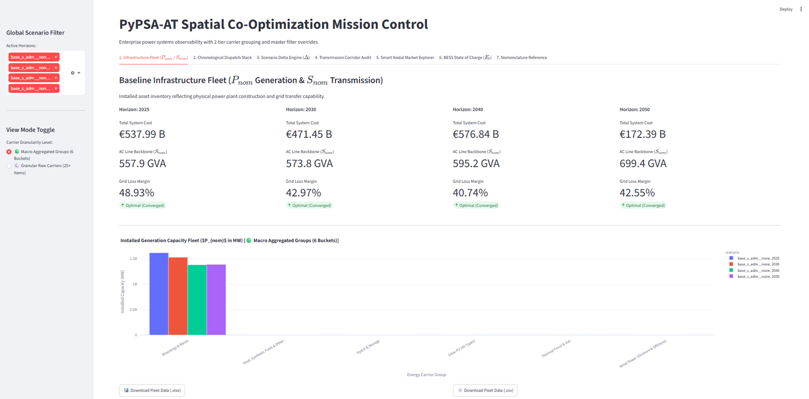 |
| *High-level generation and transmission asset overview across 2025–2050 scenarios using aggregated energy carrier groups.* |

| Granular Technology Portfolio Analysis |
|:---:|
| 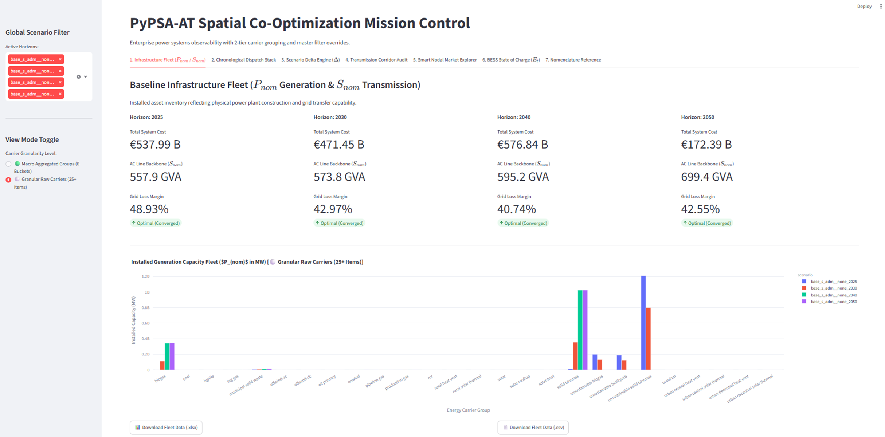 |
| *Detailed carrier-level breakdown of 25+ technologies showing capacity evolution and infrastructure transition pathways.* |

---

## 2️⃣ Chronological Dispatch Stack — Macro System View

| 2025 Baseline Dispatch | 2030 Transition Dispatch |
|:---:|:---:|
| 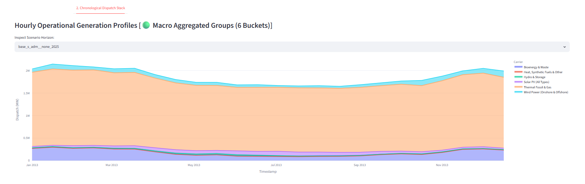 | 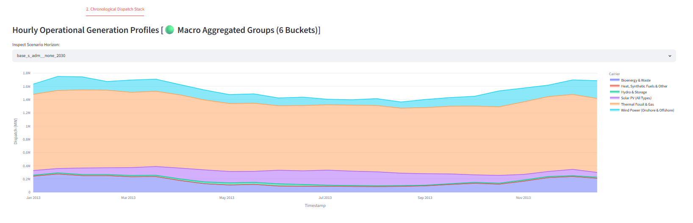 |
| *Baseline hourly generation operation profile.* | *Energy transition dispatch evolution with changing technology mix.* |

| 2040 Renewable Expansion | 2050 Net-Zero Scenario |
|:---:|:---:|
| 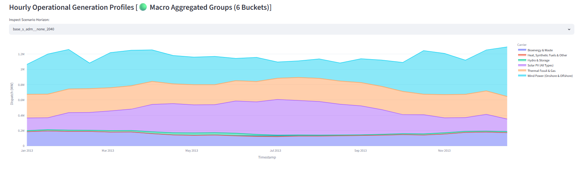 | 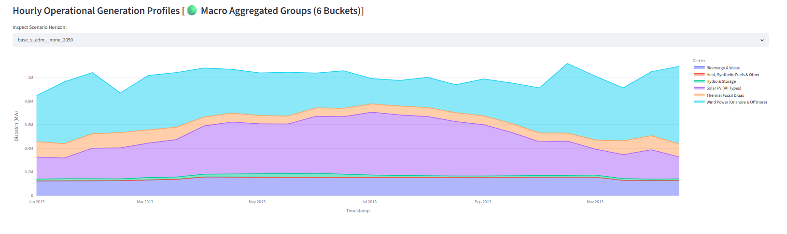 |
| *Renewable expansion and flexibility-driven operation.* | *Long-term decarbonized power system dispatch behavior.* |

---

## 3️⃣ Chronological Dispatch Stack — Granular Technology View

| 2025 Detailed Carrier Operation | 2030 Technology Transition |
|:---:|:---:|
| 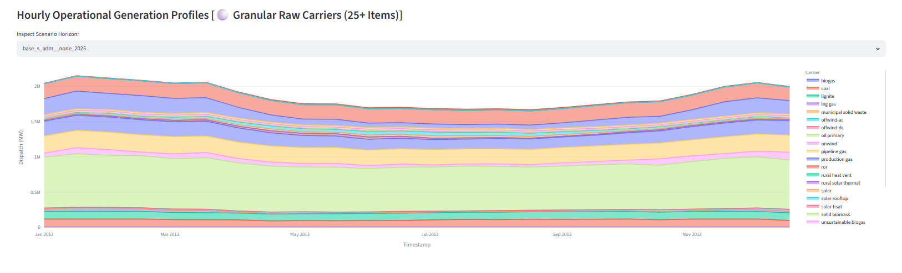 | 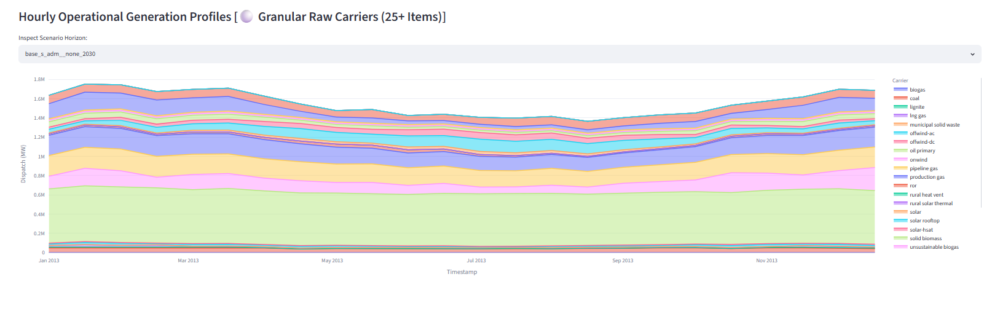 |
| *Technology-level dispatch from individual energy carriers.* | *Carrier-specific transition pathway visualization.* |

| 2040 Detailed Technology Mix | 2050 Decarbonized Portfolio |
|:---:|:---:|
| 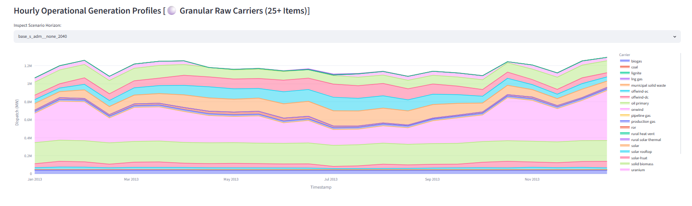 | 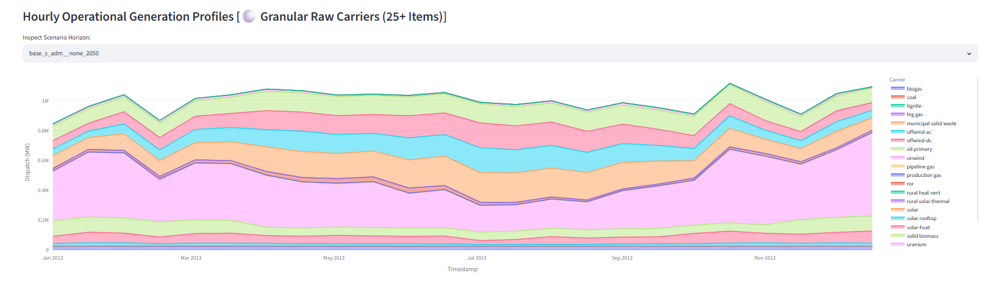 |
| *High-resolution renewable integration analysis.* | *Future carrier portfolio under deep decarbonization.* |

---

## 4️⃣ Dynamic Scenario Delta Comparator

| Aggregated Transition Analysis | Technology-Level Transition Mapping |
|:---:|:---:|
| 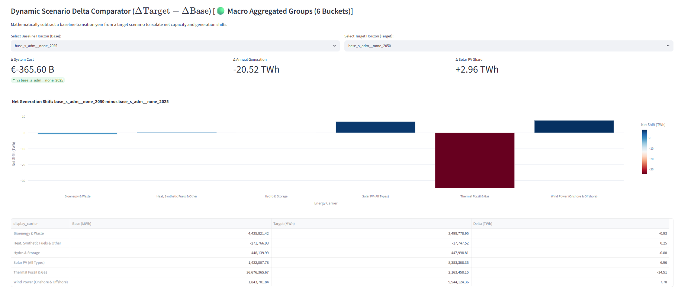 | 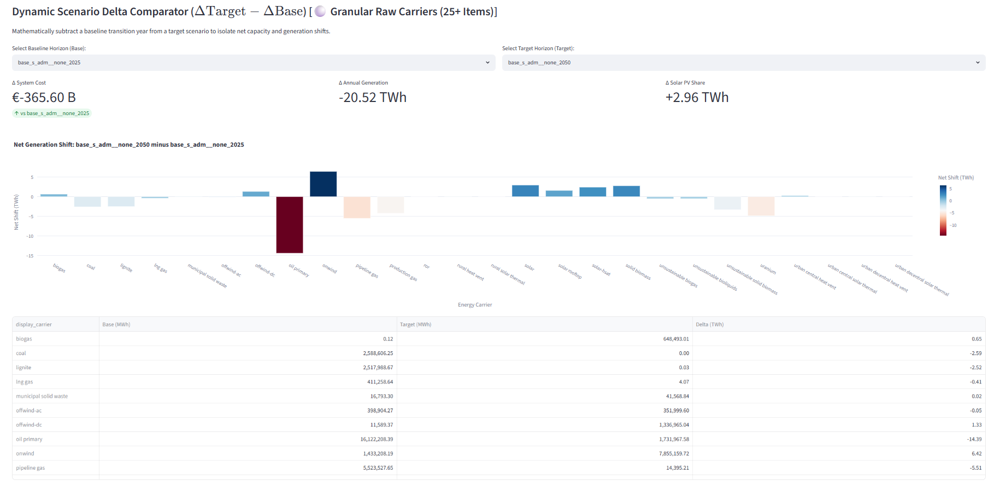 |
| *ΔTarget − ΔBase comparison showing system-wide transformation between scenarios.* | *Individual technology expansion and phase-out analysis across transition years.* |

---

## 5️⃣ Transmission Network Reliability Analytics

| Critical Corridor Screening |
|:---:|
| 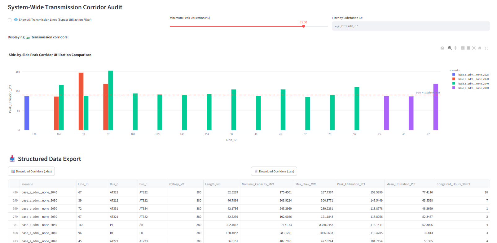 |
| *Transmission bottleneck detection using utilization thresholds, peak loading, and N-1 security indicators.* |

| Multi-Horizon Congestion Analysis | Full Network Observability |
|:---:|:---:|
| 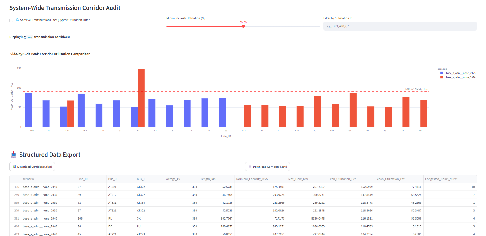 | 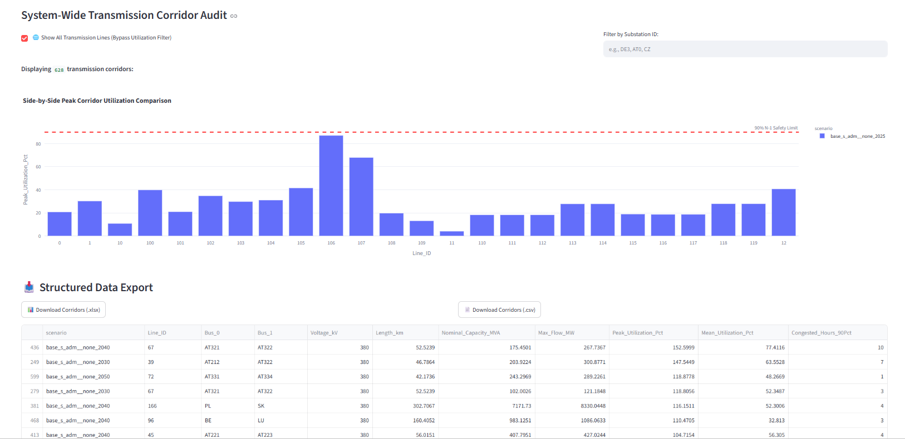 |
| *Grid loading evolution comparison across future scenarios.* | *Complete corridor database with electrical parameters and export capability.* |

---

## 6️⃣ Smart Nodal Price (LMP) Market Intelligence

| Multi-Carrier Price Diagnostics | AC Grid Regional Market Analysis |
|:---:|:---:|
| 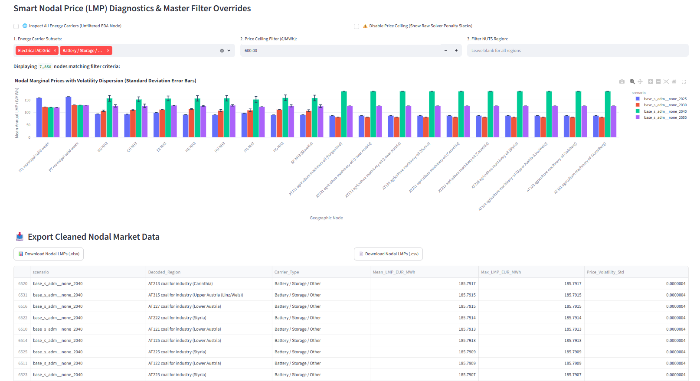 | 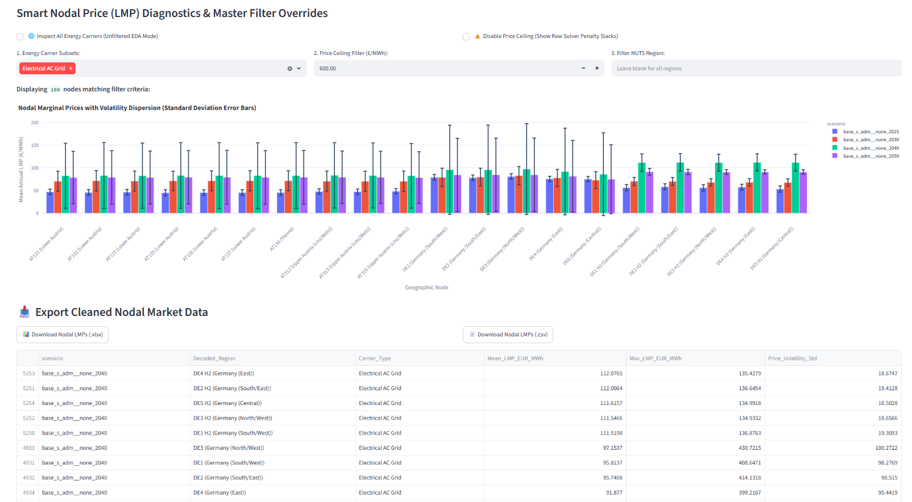 |
| *Carrier-filtered nodal marginal price and volatility analytics.* | *Regional electricity price behavior across grid locations.* |

| Full Market Observability | Solver Penalty Diagnostics |
|:---:|:---:|
| 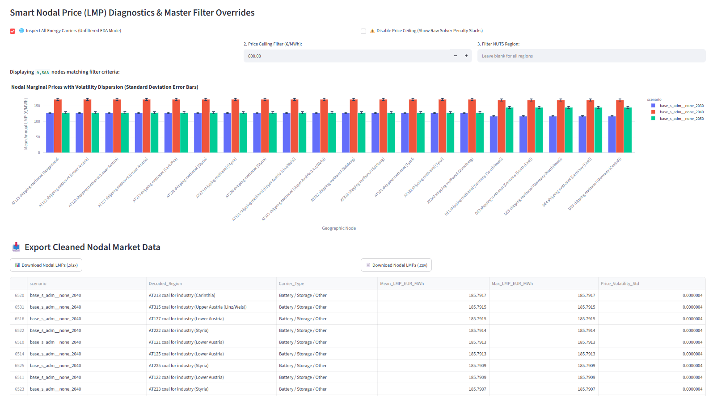 | 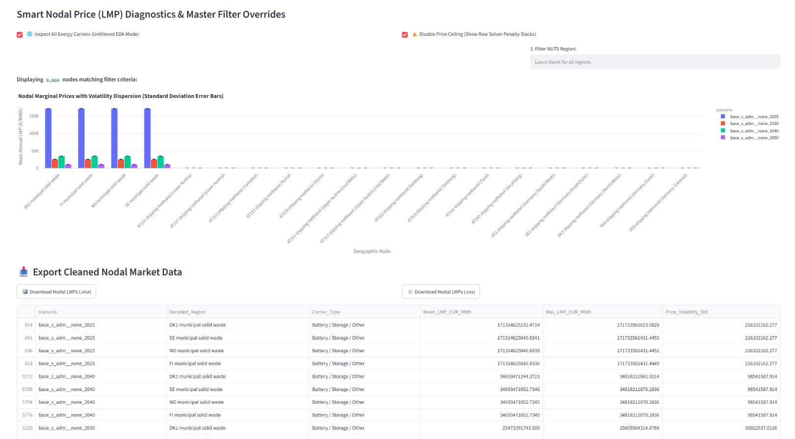 |
| *Unfiltered exploration of all market nodes and energy carriers.* | *Raw optimization diagnostics showing penalty prices and constraint effects.* |

---

## 7️⃣ Battery Storage Flexibility Analytics

| Price Duration Curve Diagnostics | Battery State-of-Charge Evolution |
|:---:|:---:|
| 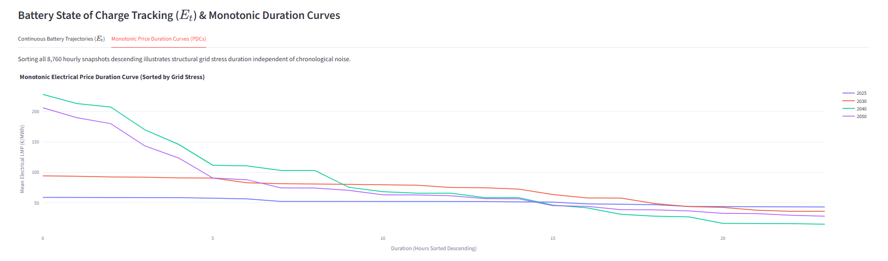 | 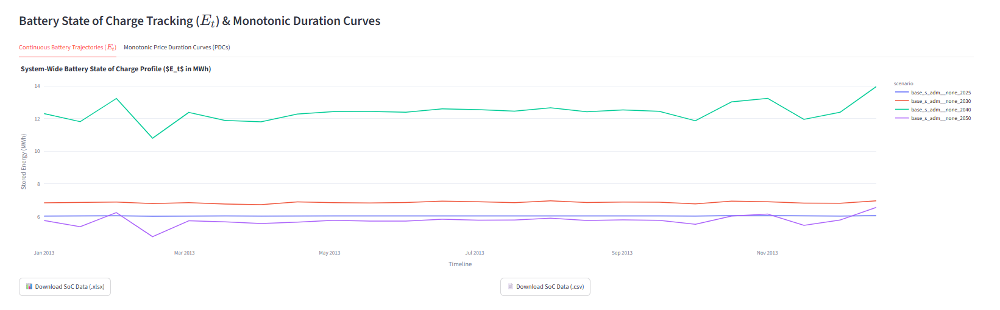 |
| *Market stress duration curves identifying flexibility and storage opportunities.* | *Battery energy trajectory analysis across long-term scenarios.* |

---

## 8️⃣ Engineering Documentation Layer

| Engineering Nomenclature & Telemetry Glossary |
|:---:|
| 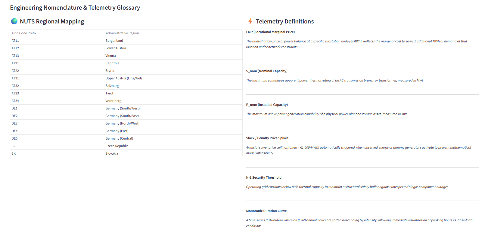 |
| *Integrated PyPSA reference system covering NUTS mapping, LMP concepts, grid metrics, and optimization terminology.* |

---


---

## Table of Contents

- [Prerequisite: Run PyPSA-AT First](#-prerequisite-run-pypsa-at-first)
- [Overview](#-overview)
- [Architecture](#-architecture)
- [Pipeline Components](#-pipeline-components)
- [Manifest & Store Schema](#-manifest--store-schema)
- [Dashboard](#-dashboard)
- [Quick Start](#-quick-start)
- [Repository Structure](#-repository-structure)
- [Technical Decisions](#️-technical-decisions)
- [Changelog](#-changelog)
- [Limitations & Future Work](#️-limitations--future-work)
- [Dependencies](#-dependencies)

---

## 🔗 Prerequisite: Run PyPSA-AT First

This platform is a **downstream analytics and provenance layer**. It never runs a power system simulation itself - it only reads the solved `.nc` network files that PyPSA-AT produces. Before anything in this repo is useful, you need to go through the full upstream modeling process:

[](https://github.com/AGGM-AG/pypsa-at)

```
  1. AGGM-AG/pypsa-at            (separate repo, run this first)
     - clone, configure, solve
     - Linux, git + pixi required
              │
              │ produces
              ▼
     results/*.nc
              │
              │ copy into this repo's results/
              ▼
  2. pypsa-at_analytics          (this repo, starts here)
     - archive_run.py
     - extract_runs.py
     - Streamlit dashboard
```

**Step-by-step:**

1. **Clone and set up the actual simulation model** ([AGGM-AG/pypsa-at](https://github.com/AGGM-AG/pypsa-at) - Linux only, requires [git](https://git-scm.com/install) and [pixi](https://pixi.prefix.dev/latest/#installation)):
   ```bash
   git clone https://github.com/AGGM-AG/pypsa-at.git && cd pypsa-at
   pixi run workflow
   ```
2. **Configure and solve a scenario** by editing `config/config.at.yaml` (and `config/scenarios.manual.yaml` for scenario variants) in that repo, then re-running the workflow. This is the long-running, compute-heavy part - a full Austrian sector-coupled solve can take a while depending on your hardware.
3. **Locate the solved output** - the workflow writes solved networks into that repo's own `results/` directory.
4. **Bring the `.nc` file(s) over to this repo's `results/` folder** (copy or point this project at that path).
5. **Only now does the rest of this README apply** - checkpoint with `archive_run.py`, ingest with `extract_runs.py`, and explore in the dashboard.

> 💡 If you re-run PyPSA-AT with a different config, it overwrites `results/*.nc` in that repo too - which is exactly the "invisible mutation" problem this analytics layer exists to solve. Checkpoint each run with `archive_run.py` (see below) before moving on to the next PyPSA-AT config change.

---

## 🔭 Overview

*(Assumes you've already completed the [Prerequisite](#-prerequisite-run-pypsa-at-first) step above and have solved `.nc` files in `results/`.)*

Large-scale PyPSA-AT runs solve into `results/*.nc` - and every re-run with a modified config **overwrites** those files. There is only ever *one* `results/base_s_adm__none_2030.nc` on disk at a time. Without extra bookkeeping, once you overwrite it you lose the ability to say *which config produced which numbers*.

This platform solves that **without ever copying or regenerating `.nc` files**, by splitting the problem into two independent, composable layers:

| Concern | Handled by | Persists to |
|---|---|---|
| 🧬 **Provenance** - which config produced this run? | `archive_run.py` | `runs/<run_tag>/manifest.yaml` |
| 📊 **Analytics** - what do the numbers say across runs? | `extract_runs.py` | `data/*.parquet` |
| 🔀 **Regression** - what changed between two runs? | `diff_configs.py` | printed table / CSV |

**At a glance:** 3 provenance scripts · append-only Parquet lake · 8-tab Streamlit workbench · zero `.nc` duplication.

**Why keep them separate?**

| Scenario | What you'd reach for |
|---|---|
| Just solved a run, about to change the config | `archive_run.py --tag <name>` - checkpoint *now* |
| Want cross-scenario KPI comparisons in the dashboard | `extract_runs.py` - ingest into Parquet |
| Need to know exactly which parameters changed | `diff_configs.py --base <a> --target <b>` |

---

## 🏗 Architecture

> The top box below is produced entirely by the separate [AGGM-AG/pypsa-at](https://github.com/AGGM-AG/pypsa-at) repo (see [Prerequisite](#-prerequisite-run-pypsa-at-first)). Everything from `results/*.nc` downward is this repo.

```
┌──────────────────────────────────────────────────────────────────────────┐
│                        SYSTEM DATA FLOW                                  │
├──────────────────────────────────────────────────────────────────────────┤
│                                                                          │
│   ┌──────────────┐                                                      │
│   │ PyPSA-AT     │                                                      │
│   │ solve        │                                                      │
│   └──────┬───────┘                                                      │
│          │ writes / overwrites                                         │
│          ▼                                                              │
│   ┌──────────────┐                                                      │
│   │ results/*.nc │ ← ephemeral, single copy on disk                    │
│   └──────┬───────┘                                                      │
│          │                                                              │
│   ┌──────┴───────────────────────────┐                                  │
│   ▼                                  ▼                                  │
│ ┌────────────────────┐      ┌─────────────────────┐                     │
│ │ archive_run.py      │      │ extract_runs.py      │                     │
│ │ - snapshot config/  │      │ - read results/*.nc  │                     │
│ │ - fingerprint .nc   │      │ - match by filename  │                     │
│ │ - record git commit │      │   + size to run_tag  │                     │
│ └──────────┬──────────┘      └──────────┬──────────┘                     │
│            │                             │                               │
│            ▼                             ▼                               │
│ ┌─────────────────────┐       ┌──────────────────────┐                   │
│ │ runs/<run_tag>/      │──────▶│ data/*.parquet        │                  │
│ │  manifest.yaml       │ match │ append, dedup by      │                  │
│ │  config/*.yaml       │       │ run_tag + scenario    │                  │
│ └─────────────────────┘       └──────────┬───────────┘                   │
│                                            │                              │
│                                            ▼                              │
│                              ┌──────────────────────────┐                 │
│                              │  app.py - Streamlit       │                 │
│                              │  8-tab workbench           │                 │
│                              └──────────────────────────┘                 │
└──────────────────────────────────────────────────────────────────────────┘
```

---

## ⚙️ Pipeline Components

### Component 1 - Provenance Engine (`archive_run.py`)

Run this **immediately after a solve completes**, before touching the config again. It snapshots the current `config/*.yaml` into `runs/<tag>/config/` and fingerprints every `results/*.nc` present at that moment.

```bash
python scripts/archive_run.py \
    --tag baseline_2025.04 \
    --notes "Initial AT_KN2040 baseline, AT split into 3 admin regions, H2 electrolysis min 1 GW."
```

> Fingerprint = filename + byte size, optionally a SHA-256 hash. This is your checkpoint - it's what lets `extract_runs.py` later prove which config produced a given `.nc`.

---

### Component 2 - ETL Engine (`extract_runs.py`)

Reads `results/*.nc`, matches each file back to the run that archived it, tags every extracted row with that `run_tag`, and **appends** into the Parquet store - it never overwrites.

```bash
python scripts/extract_runs.py
```

```
results/*.nc ──▶ matched to run_tag ──▶ appended ──▶ data/*.parquet
                                          (dedup on run_tag + scenario)
```

> Older runs already in the Parquet store stay untouched even after their `.nc` file is long gone from `results/`.

---

### Component 3 - Regression Engine (`diff_configs.py`)

Deep-diffs two archived runs' merged config YAMLs into a flat, old-value-vs-new-value table.

```bash
python scripts/diff_configs.py --base baseline_2025.04 --target high_h2_electrolysis
```

---

## 📋 Manifest & Store Schema

```
┌────────────────────┬──────────────────────────────────────────────────────┐
│ Field               │ Description                                          │
├────────────────────┼──────────────────────────────────────────────────────┤
│ run_tag             │ Human-chosen identifier, e.g. "baseline_2025.04"      │
│ created_at          │ ISO timestamp of the archive_run.py call              │
│ git_commit          │ SHA of the code state that produced the run           │
│ notes               │ Free-text description supplied via --notes           │
│ nc_fingerprints[]   │ filename + byte size (+ optional SHA-256) per .nc     │
│ config_snapshot     │ Point-in-time copy of config/*.yaml                   │
└────────────────────┴──────────────────────────────────────────────────────┘
```

**Parquet row key:** composite primary key of `run_tag + scenario` - re-running the ETL is idempotent; matching rows are silently upserted rather than duplicated.

---

## 📊 Dashboard

The **Scenario Provenance & Report** tab in `app.py` ties everything together:

| Panel | Shows |
|---|---|
| 🗂️ Manifest overview | When, git commit, linked networks, your notes |
| 🔀 Config diff table | Every parameter delta, old value vs. new value |
| 📈 KPI / dispatch deltas | Cost, generation, PV/wind, grid losses, transmission capacity |
| 📝 Narrative summary | Auto-generated paragraph tying the config change to the outcome |
| 📤 Export | Excel/CSV of the full comparison |

**Illustrative example** (numbers are placeholders - your dashboard will populate real deltas):

| KPI | `baseline_2025.04` | `high_h2_electrolysis` | Δ |
|---|---|---|---|
| System OPEX | €1.42 bn | €1.38 bn | **−2.8%** ✅ |
| CAPEX | €3.10 bn | €3.46 bn | +11.6% |
| Grid losses | 4.1% | 3.9% | −0.2 pp |
| Curtailment | 6.7% | 5.9% | −0.8 pp |

> Once more than one run has been extracted, scenario names appear as `<scenario> [<run_tag>]` throughout the dashboard, so every tab stays disambiguated automatically.

---

## 🚀 Quick Start

### 0 - Generate your data (separate repo, do this first)

```bash
git clone https://github.com/AGGM-AG/pypsa-at.git && cd pypsa-at
pixi run workflow
```

This is the actual simulation - Linux only, requires `git` + `pixi`, and produces `results/*.nc` in *that* repo. See [Prerequisite](#-prerequisite-run-pypsa-at-first) for the full walkthrough. Copy the resulting `.nc` file(s) into this repo's `results/` folder before continuing.

### 1 - Clone

```bash
git clone https://github.com/AIMLDS7/pypsa-at_analytics.git
cd pypsa-at_analytics
```

### 2 - Install dependencies

```bash
pip install streamlit>=1.30 pandas>=2.0 pyarrow>=14.0 pyyaml>=6.0 \
            gitpython>=3.1 deepdiff>=6.7 xlsxwriter>=3.1
```

### 3 - Run the pipeline

```bash
# a) Solve PyPSA-AT normally -> produces results/*.nc

# b) Checkpoint before touching the config again
python scripts/archive_run.py --tag baseline_2025.04 \
    --notes "Initial AT_KN2040 baseline."

# c) Ingest into the Parquet store
python scripts/extract_runs.py

# d) Change config/config.at.yaml, re-solve, checkpoint again with a new --tag,
#    then extract again - both runs now coexist in data/*.parquet
```

### 4 - Launch the dashboard

```bash
streamlit run app.py
```

Then open **Scenario Provenance & Report**.

<details>
<summary>🪟 <b>PowerShell equivalents</b> (Windows)</summary>

```powershell
python scripts/archive_run.py `
    --tag "baseline_2025.04" `
    --notes "Initial AT_KN2040 baseline, AT split into 3 admin regions."

python scripts/extract_runs.py

python scripts/diff_configs.py --base "baseline_2025.04" --target "high_h2_electrolysis"
```

> Make sure your PowerShell execution policy allows script execution if wrapping these in `.ps1` automation.

</details>

---

## 📁 Repository Structure

```
📦 pypsa-at_analytics/
│
├── ⚙️ config/                          ← Live config for the NEXT PyPSA-AT run
│   ├── config.at.yaml
│   └── scenarios.manual.yaml
│
├── 🗂 runs/                             ← Provenance archive
│   └── <run_tag>/
│       ├── manifest.yaml               ← created_at, git commit, notes, .nc fingerprints
│       └── config/                     ← snapshot copy of config/*.yaml at archive time
│
├── 📉 results/                          ← Solved NetCDF networks (.nc), copied over from AGGM-AG/pypsa-at - OVERWRITTEN each run
├── 📊 data/                             ← Durable Parquet dashboard store (append-only)
│
├── 🐍 scripts/
│   ├── manifest_utils.py               ← shared helpers (git commit, fingerprinting, manifest I/O)
│   ├── archive_run.py                  ← snapshot config + fingerprint results into runs/<tag>/
│   ├── diff_configs.py                 ← deep-diff two runs' config YAMLs
│   ├── extract_runs.py                 ← run_tag-aware ETL, appends to the Parquet store
│   ├── audit_baseline.py               ← baseline capacity share tables
│   ├── analyze_corridor.py             ← line loading & congestion duration
│   └── run_expansion_study.py          ← grid expansion co-optimization runner
│
├── 🖥 app.py                            ← Streamlit workbench (8 tabs, incl. Report tab)
├── 📄 README.md
└── 📄 LICENSE
```

---

## ⚙️ Technical Decisions

**Why fingerprint by filename + size instead of always hashing?**
Full SHA-256 hashing of multi-GB `.nc` files on every checkpoint is expensive. Filename + byte size is enough to reliably match a file back to the run that produced it in normal use; the optional SHA-256 is there for when you need cryptographic certainty.

**Why append-only Parquet instead of overwriting the store?**
`results/*.nc` is already ephemeral - one copy at a time. If the analytics store followed the same pattern, every new run would erase the ability to compare against the previous one. Append-only, deduplicated by `run_tag + scenario`, means old runs stay queryable long after their source `.nc` is gone.

**Why `run_tag + scenario` as the composite key, not just `scenario`?**
Scenario names are often reused across experiments (e.g. `2030` appears in every run). Without `run_tag` in the key, a later run would silently overwrite an earlier one with the same scenario name instead of coexisting alongside it.

**Why tag ungoverned extracts as `unarchived` instead of failing?**
Forgetting to run `archive_run.py` before extracting shouldn't lose your data - it should just tell you, loudly, that this batch has no config lineage. Rows are ingested and clearly labeled rather than silently dropped or blocking the pipeline.

**Why offer `--reset` on `extract_runs.py`?**
During active development the Parquet store can accumulate stale test runs. `--reset` rebuilds it from scratch using only what's currently in `results/`, without needing to manually delete files.

---

## 📋 Changelog

### v2.0 - Provenance Layer
- Added `archive_run.py` - config snapshot + `.nc` fingerprinting into `runs/<tag>/`
- Added `diff_configs.py` - structural YAML deep-diff between two runs
- `extract_runs.py` upgraded to be `run_tag`-aware; **appends** instead of overwriting
- Added **Scenario Provenance & Report** tab to `app.py` (now 8 tabs total)
- Dropdown labels across all tabs now disambiguate via `<scenario> [<run_tag>]`
- Added `--reset` flag to `extract_runs.py` for clean re-syncs during development

### v1.0 - Initial Dashboard
- Streamlit workbench over a single-snapshot Parquet extraction of `results/*.nc`
- Baseline capacity share and corridor congestion analytics tabs

---

## ⚠️ Limitations & Future Work

**Current limitations:**

| Limitation | Impact |
|---|---|
| Fingerprint match relies on filename + size by default | Two different `.nc` files that happen to share both could theoretically collide - enable full SHA-256 for strict environments |
| No automatic trigger after a solve | `archive_run.py` must be run manually right after each solve, or lineage is lost for that batch |
| Single-machine Parquet store | Not yet partitioned/distributed for very large numbers of concurrent scenario runs |
| No built-in run cleanup policy | `runs/` grows unbounded; old manifests must be pruned manually |

**Planned improvements:**

- [ ] Git pre/post-solve hook to auto-invoke `archive_run.py`
- [ ] Optional partitioned Parquet layout (by year / scenario family)
- [ ] Manifest retention policy / archival to cold storage
- [ ] Richer narrative engine (LLM-assisted KPI-to-config explanations)
- [ ] CI check that fails if `extract_runs.py` is run without a matching manifest

---

## 📦 Dependencies

| Package | Role |
|---|---|
| `streamlit` | Dashboard UI |
| `pandas` | Data wrangling, KPI aggregation |
| `pyarrow` | Parquet read/write |
| `pyyaml` | Config & manifest I/O |
| `gitpython` | Git commit introspection for manifests |
| `deepdiff` | Structural YAML diffing in `diff_configs.py` |
| `xlsxwriter` | Excel export from the Report tab |

---

<div align="center">


**Built with ⚡ PyPSA · 🐼 Pandas · 📊 Streamlit · 🪶 Apache Parquet**

*Model faster. Track everything.*

[](https://github.com/AIMLDS7)

</div>
